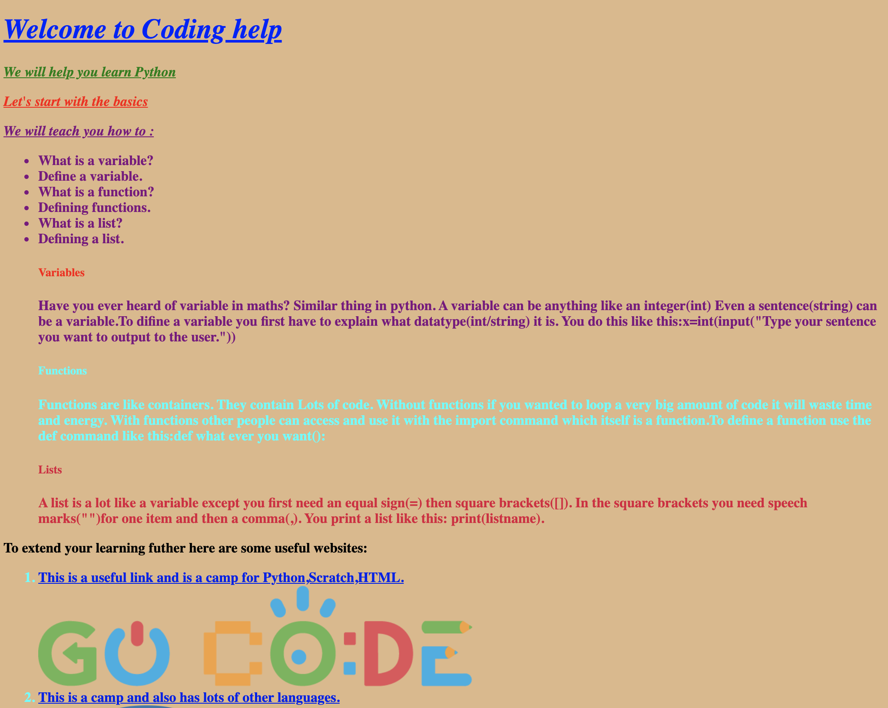

# students.gocode.academy

Website featuring HTML code written by kids. 

As part of a summer camp, I taught children, with no prior web development experience, between the ages of 6 and 16 how to make websites using HTML and basic JavaScript. Here is their work!

### Some personal favourites:

#### Find a book
https://github.soneji.xyz/students.gocode.academy/2019_Summer_Harrow_2/FindABook/

#### PyMath
https://github.soneji.xyz/students.gocode.academy/2019_Summer_Harrow_2/PyMath.html/

#### Luke
https://github.soneji.xyz/students.gocode.academy/2019_Summer_Harrow_2/luke/

#### Siddarth
https://github.soneji.xyz/students.gocode.academy/2019_Summer_Harrow_1/siddharth/
